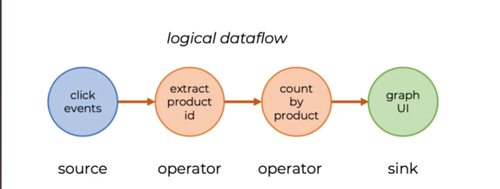
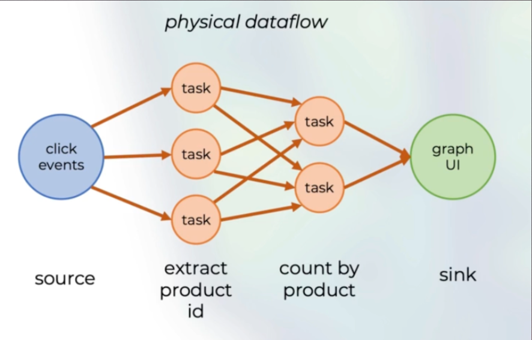
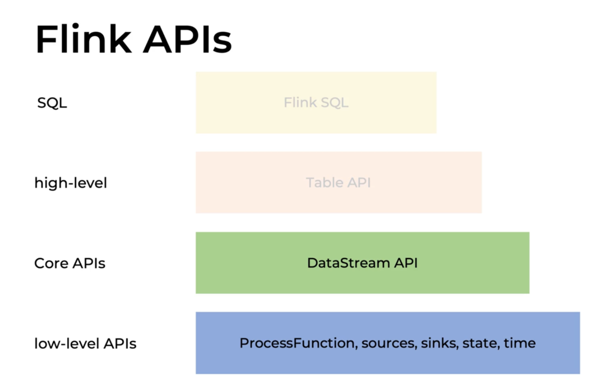

## Use Cases
Event driven applications
Low latency data pipelines
Realtime data analytics

## Compared to
Spark
* micro batching
  Kafka
* message buss
  Beam
* flink is more powerful and more expressive
  Akka Streams
* flink is better for data related outcomes

Airflow
* workflow management and scheduler, no processing or computation on its own

## Streaming Concepts
Data flow - data ingested into system
operator - independent logical processing step, can be parallelized into tasks
task - instance of operator that works on a partition of the data

parallelize example

## Latency vs throughput
* latency - time between event and result, processing time
* throughput - count of processed events
* lower latnecy increases throughput

## Event time vs processing time
* all events are time stamped
* event time - time event was created
* process time - time event arrived in  processor
* choosing event time vs processing time can lead to diff results

## Flink APIs

low-level APIs - ProcessFunction, sources, sinks, state, time
Core APIs - DataStream API
high-level - Table API
SQL - Flink  SQL

DataStreamAPIs and low level APIs make it very flexible to process data as you go up to more high level flexibility drops off